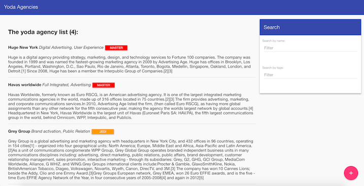

SL challenge
============

* Challenge source : https://github.com/sortlist/jobs

Misc doc :
* https://github.com/adam-p/markdown-here/wiki/Markdown-Cheatsheet

Plan :
* Create PostgresSQL local instance and py config file
* Py Bottle
    * Architecture
    * Design Test(s)
        * https://docs.python.org/3/library/unittest.html
        * http://docs.python-guide.org/en/latest/writing/tests/
* Angular JS architecture
    * Architecture
    * Design Test(s)
        * https://jasmine.github.io/1.3/introduction.html
        * view-source:file:///Users/ludovicgustin/Downloads/jasmine-standalone-2.8.0/SpecRunner.html
        * https://docs.angularjs.org/guide/unit-testing
* Dev phase
* Documentation to run

SUB-TASKS :
* TODO : ~~refresh angular list when adding a new agency (no refresh)~~
* TODO : ~~bower material dependencies~~
* TODO : ~~error/success messages~~
* TODO : ~~responsive behaviour~~
* TODO : ~~testing back~~
* TODO : ~~testing front~~
* TODO : ~~custom styles into proper CSS~~
* (TODO) : refactor agency-list and creator into isolated angular components

### LESSONS LEARNED :
- Quick launch : https://github.com/angular/angular-seed
- setup of testing first (TDD)
- Bootstrap >>> Angular Material (js), for bugs, stability and overall ease of building layout + UI
- Node.js VS py bottle for quick back-end ?
- CSS incremental

### INSTALLATION (FIXED)
1. Install python 2.7.X https://www.python.org/
1. Install the Python packet manager PIP https://pip.pypa.io/en/stable/installing/
    1. Install the `sudo pip install bottle`
    1. Install the Sqlalchemy ORM libs: `sudo pip install SQLAlchemy`
    1. Install ORM dependency : `sudo pip install psycopg2`
2. Install npm https://www.npmjs.com/
3. `npm install`, will also handle `bower` automatically
3. If npm is returning a `postinstall` error for bower, manually :
    2. ~~Install bower https://bower.io/~~
    2. `bower install` from root dir to load js libs // BROKEN NPM
4. Postgres SQL :
    * Create an instance of postgres DB https://www.postgresql.org/
    * Edit `SLConfig.py` to map your instance
    * `python SLModels.py` to create schema
5. Run the server `python SLServer.py`
6. Enjoy from http://localhost:8080

### TESTS
1. front : `npm test`
2. back : `python /test/TestSLDao.py`